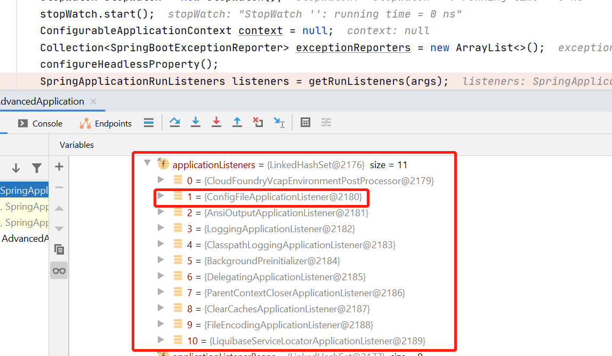

## SpringBoot Tomcat 获取配置文件

前面几篇文章我们已经讲解了,SpringBoot的启动原理以及Tomcat的启动流程，但是我们在修改Tomcat的配置时，他是如何进行修改的配置呢？

### ServerProperties

首先我们来看一下`ServerProperties`,这里写了关于,Tomcat的相关配置，；例如：
```java
@ConfigurationProperties(prefix = "server", ignoreUnknownFields = true)
public class ServerProperties {
	private Integer port;
	private String serverHeader;
	private Ssl ssl;
    .....
}
```
`@ConfigurationProperties`  外部化配置的注释，当然您也可以显示的通过`@Value`来绑定，但是在这样比较笨重，这里不过多介绍，
使用还是很简单的，只需要被Spring扫描到就可以，这样在容器初始化的时候就可以将他作为bean放在容器中，在使用是通过Get方法进行获取
我们知道了 `ServerProperties` 的配置文件,但是它就近是如何获取的呢？追溯到[SpringApplication源码解析](SpringApplication.md)
在那时我们是不是看过这样的一段代码:
```java
public ConfigurableApplicationContext run(String... args) {
	StopWatch stopWatch = new StopWatch();
	stopWatch.start();
	ConfigurableApplicationContext context = null;
	Collection<SpringBootExceptionReporter> exceptionReporters = new ArrayList<>();
	configureHeadlessProperty();
	SpringApplicationRunListeners listeners = getRunListeners(args);
	listeners.starting();
    ....... 
	return context;
}
```
那是我们并没说，`getRunListeners(args);`获取了那些监听，实则如下：



对于本文来说，重点在`ConfigFileApplicationListener`,其源码如下:
```java
public class ConfigFileApplicationListener implements EnvironmentPostProcessor, SmartApplicationListener, Ordered {

    private static final String DEFAULT_PROPERTIES = "defaultProperties";

    // 默认获取文件的路径
    private static final String DEFAULT_SEARCH_LOCATIONS = "classpath:/,classpath:/config/,file:./,file:./config/*/,file:./config/";
    //文件名
    private static final String DEFAULT_NAMES = "application";

    private static final Set<String> NO_SEARCH_NAMES = Collections.singleton(null);

    private static final Bindable<String[]> STRING_ARRAY = Bindable.of(String[].class);

    private static final Bindable<List<String>> STRING_LIST = Bindable.listOf(String.class);

    private static final Set<String> LOAD_FILTERED_PROPERTY;
}
```
读取搭配配置文件中的参数后通过@ConfigurationProperties注解的一个松散的绑定机制注入到默认配置实体类中。这样就实现了，我们配置了新的熟悉，Spring会获取我们修改后的属性


