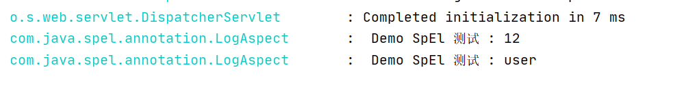

**导语**

------

在前面我们介绍了 [SpEl(Spring Expression Language)解析](SpELBaseInfo.md) 与[Spring SpEl高级语法](SpElGrammar.md)，
但是SpEl在时间的开发中能帮助我们做些什么呢？该如何与自己的业务进行匹配呢？本讲将介绍一种使用方式，Aop + SpEl实现日志记录！
主要是通过SpEl实现自定义的记录.Aop大家应该都很熟悉，这里不做过多介绍，如果不是很了解，
可以先阅读[Spring Aop 核心概念](http://mp.weixin.qq.com/s?__biz=MzU0MjQ2MTA5NQ==&mid=2247484380&idx=1&sn=21f034a51e09bb38a5128e1a47ef794d&chksm=fb1b1e14cc6c970271322170394fc6ee08d4e1199ac5494c2b05e3f9ce339f558a418f1428a8#rd) ，下面我将进行核心的业务开发。

### 自定义注解

```java
@Target(ElementType.METHOD)
@Retention(RetentionPolicy.RUNTIME)
@Documented
public @interface DemoLog {

    String name() default "demo";

    String el();
}

```


### Aop 实现

```java
@Slf4j
@Aspect
@Component
public class LogAspect {

    @Pointcut(value = "@annotation(DemoLog)")
    public void logAspect() {

    }

    /**
     * 环绕处理
     *
     * @param joinPoint
     * @throws Throwable
     */
    @Around(value = "logAspect()")
    public Object getAroundLog(ProceedingJoinPoint joinPoint) throws Throwable {
        Object proceed;
        try {
            //前置处理
            saveLogAspect(joinPoint, null);
            proceed = joinPoint.proceed();
            return proceed;
        } catch (Throwable throwable) {
            saveLogAspect(joinPoint, throwable);
            throw new RuntimeException(throwable.getMessage());
        }
    }


    private void saveLogAspect(JoinPoint joinPoint, Throwable throwable) {
        MethodSignature methodSignature = (MethodSignature) joinPoint.getSignature();
        try {
            // 获取自定义注解
            DemoLog demoLog = methodSignature.getMethod().getAnnotation(DemoLog.class);
            if (Objects.nonNull(demoLog)) {
                Object spEl = AspectExpress.getSpEl(joinPoint, methodSignature, demoLog.el(), Object.class);
                if (log.isInfoEnabled()) {
                    log.info(" SpelLog {}", spEl);
                }
            }
        } catch (Exception e) {
            log.error(e.getMessage());
        }
    }

}

```


### 自定义 SpEl解析器

```java
public class AspectExpress {


    public static <T> T getSpEl(JoinPoint joinPoint, MethodSignature methodSignature, String el, Class<T> clazz){
        EvaluationContext context = getContext(joinPoint.getArgs(), methodSignature.getMethod());
        return getValue(context, el, clazz);
    }

    /**
     * 获取spel 定义的参数值
     *
     * @param context 参数容器
     * @param key     key
     * @param clazz   需要返回的类型
     * @param <T>     返回泛型
     * @return 参数值
     */
    private static <T> T getValue(EvaluationContext context, String key, Class<T> clazz) {
        SpelExpressionParser spelExpressionParser = new SpelExpressionParser();
        Expression expression = spelExpressionParser.parseExpression(key);
        return expression.getValue(context, clazz);
    }


    /**
     * 获取参数容器
     *
     * @param arguments       方法的参数列表
     * @param signatureMethod 被执行的方法体
     * @return 装载参数的容器
     */
    private static EvaluationContext getContext(Object[] arguments, Method signatureMethod) {
        String[] parameterNames = new LocalVariableTableParameterNameDiscoverer().getParameterNames(signatureMethod);
        if (parameterNames == null) {
            throw new RuntimeException("参数列表不能为null");
        }
        EvaluationContext context = new StandardEvaluationContext();
        for (int i = 0; i < arguments.length; i++) {
            context.setVariable(parameterNames[i], arguments[i]);
        }
        return context;
    }

}
```

### 效果演示

```java
@RestController
public class SpElDemo {

    @DemoLog(el = "#id")
    @GetMapping(value = "spel/demo/{id}")
    public void get(@PathVariable("id") Integer id){

    }

    @DemoLog(el = "#user.name")
    @GetMapping(value = "spel/demo")
    public void get(SecurityProperties.User user){

    }
}
```



加上以SpEl的功能可以让我们的Aop操作更加强大。也可以实现更多的处理，可以是我们的日志更加丰富,[项目源代码](https://github.com/yanghaiji/IT-Demo)